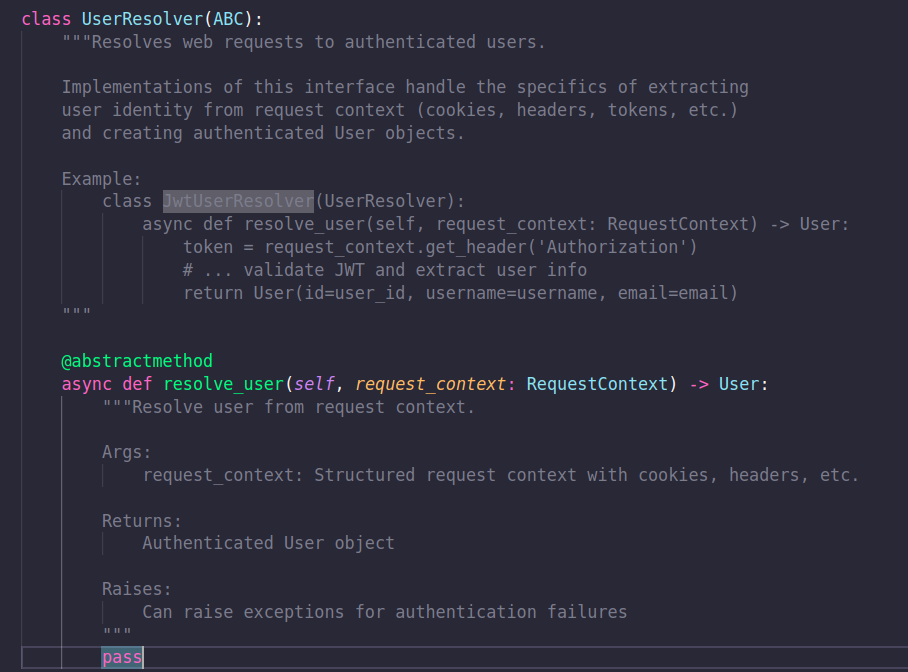
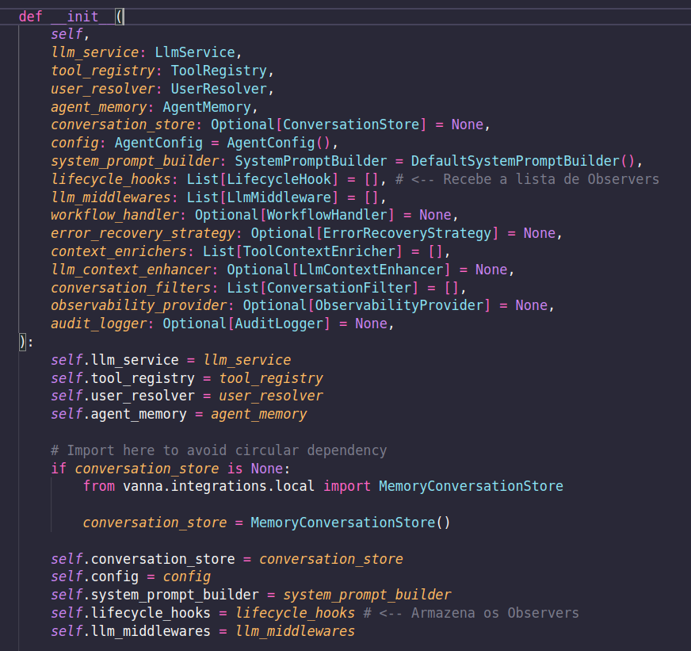
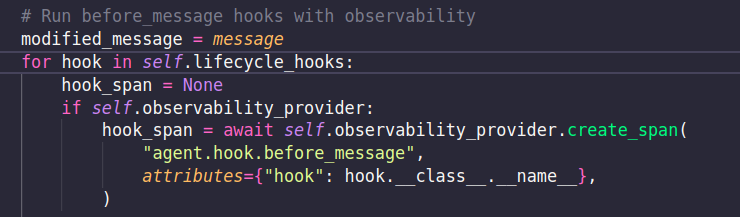
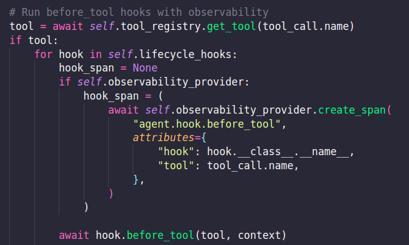
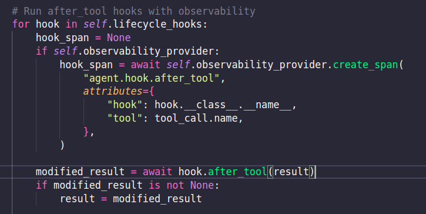
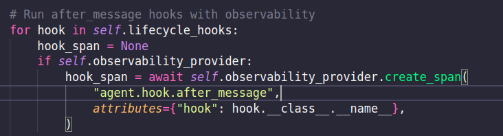

# Evidências - padrões de projeto


## Padrão de projeto Strategy 

O padrão Strategy define uma família de algoritmos(estratégias), encapsula cada uma delas e as torna intercambiáveis sem alterar o código do cliente.

Objetivo: Criar uma Strategy para cada variante e fazer com que o método delegue o algoritmo para uma instância de Strategy, ou seja, parametrizar os algoritmos usados e tornar uma classe "aberta" a novos algoritmos.


# Como o projeto Vanna utiliza o padrão strategy


## UserResolver:

```python
class UserResolver(ABC):
    @abstractmethod
    async def resolve_user(self, request_context: RequestContext) -> User:
        pass

```

 Interface, onde define "como resolver o usuário", mas não implementa nada. Possui um metodo abstrato resolve_user, que deve obrigatoriamente ser implementado por qualquer classe concreta que herde de UserResolver. 

 A classe Agent não implementa esse método, ela apenas recebe uma estratégia concreta de resolução de usuário através de injeção de dependência.

## ConversationStore

```python
class ConversationStore(ABC):
    @abstractmethod
    async def create_conversation(...):
        pass
```


UserResolver é uma interface implementada como uma classe abstrata. Ela define o contrato para resolver o usuário, através do método abstrato. Esse método não é implementado na classe base, e qualquer classe que herde de UserResolver deve obrigatoriamente fornecer sua própria implementação.


O padrão implementado é o que o Strategy exige:

* Uma família de comportamentos
* Cada comportamento é definido por uma interface
* A implementação é decidida depois

---

#  3. A classe Agent depende das interfaces, não das implementações

 A classe Agent não cria estratégias. Elea recebe estratégias prontas, exatamente como o Strategy define.
 A figura abaixo representa o trecho do construtor da classe, evidenciando que recebe tais estrategias e delega a responsabilidades pra tais classes abstratas.


Analisando oscomentário encontrado na classe, fica evidente que o mecanismo de resolver o usuário é totalmente desacoplado do Agent. Isso significa que o comportamento pode ser trocado por outra estratégia — JWT, cookies, headers, OAuth, etc. — sem modificar o código do Agent, já que ele depende apenas da interface UserResolver.

O mesmo padrão se aplica às classes ConversationStore e LlmService: ambas são plugáveis, seguem contratos abstratos e permitem substituir a estratégia em tempo de execução, mantendo o Agent fechado para modificação e aberto para extensão.

Comentario encontrado no projeto:



---


## Padrão de projeto Observer 

O padrão Observer define uma relação de dependência um-para-muitos entre objetos. Quando um objeto, conhecido como Subject (Sujeito), muda seu estado, todos os seus dependentes, conhecidos como Observers (Observadores), são notificados e atualizados automaticamente.

Objetivo: Permitir que um objeto (o Subject) notifique uma lista de objetos dependentes (os Observers) sobre qualquer mudança de estado, sem que o Subject precise saber quem são ou como eles irão reagir. Isso promove um baixo acoplamento entre o Sujeito e seus Observadores.

# Como o projeto Vanna utiliza o padrão strategy

No projeto Vanna, o padrão Observer é implementado através do sistema de LifecycleHook.

    - O Subject (Sujeito) é a classe Agent. Ela é o componente central cujo ciclo de vida de processamento de mensagens é "observado".
    - A interface do Observer (Observador) é a classe abstrata LifecycleHook.


# LifecycleHook: A interface do "Observer"

A classe LifecycleHook define o "contrato" que qualquer observador concreto deve seguir. Ela estabelece os métodos (eventos) que o Agent irá "notificar". Qualquer classe que queira "ouvir" os eventos do Agent (como um sistema de log, um verificador de cotas, etc.) pode herdar de LifecycleHook e implementar esses métodos.

```python
class LifecycleHook(ABC):
    async def before_message(self, user: User, message: str) -> Optional[str]:
        return None

    async def after_message(self, conversation: Conversation) -> None:
        pass

    async def before_tool(self, tool: Tool, context: ToolContext) -> None:
        pass
        
    async def after_tool(self, result: ToolResult) -> Optional[ToolResult]:
        return None
    
```

A classe Agent atua como o Subject. Ela faz duas coisas principais que caracterizam o padrão:

1. Registro de Observadores (Attachment): Em seu construtor, o Agent recebe e armazena uma lista de seus observadores (lifecycle_hooks), permitindo que componentes externos se registrem.



2. Notificação dos Observadores (Notify): Durante seu ciclo de vida (no método _send_message), o Agent itera sobre sua lista de lifecycle_hooks e os notifica nos momentos apropriados, chamando os métodos definidos pela interface do Observer.  A figura abaixo evidencia a notificação do evento.




Dentro do loop de ferramentas, notifica "before_tool".




NOtifica também o "after_tool" e por fim, notifica No final, notifica "after_message".






o Agent não sabe quais implementações concretas de LifecycleHook estão em sua lista. Ele apenas sabe que eles são do tipo LifecycleHook e que pode chamar métodos como after_message. Dessa forma permite que o sistema seja estendido com novos comportamentos (Observadores Concretos) sem nenhuma modificação no código da classe Agent. Por exemplo, pode-se adicionar um QuotaCheckHook (para verificar cotas de uso) ou um AuditLogHook (para auditoria) simplesmente injetando-os na lista de lifecycle_hooks durante a inicialização do Agent. Isso cumpre perfeitamente o Princípio Aberto/Fechado (Open/Closed Principle), onde o Agent está fechado para modificação, mas aberto para extensão.


## Classe Agent

A classe Agent é de suma importancia para o framework. Ela é responsável por ordenar todo o fluxo de processamento de uma mensagem, desde a recepção até a geração da resposta. No entanto, uma análise de seu construtor revela uma decisão de design crucial, como ilustado no trecho de código abaixo. O Agent não implementa como se comunicar com um LLM, como resolver um usuário ou como armazenar uma conversa. Ele depende de abstrações (interfaces) para esses comportamentos. Esse design é a fundação para os padrões que analisamos.


```python
class Agent:
    def __init__(
        self,
        llm_service: LlmService,
        tool_registry: ToolRegistry,
        user_resolver: UserResolver,
        agent_memory: AgentMemory,
        conversation_store: Optional[ConversationStore] = None,
        # ...
        lifecycle_hooks: List[LifecycleHook] = [],
        llm_middlewares: List[LlmMiddleware] = [],
        # ...
    ) -> None:
        self.llm_service = llm_service
        self.tool_registry = tool_registry
        self.user_resolver = user_resolver
        self.agent_memory = agent_memory
        self.conversation_store = conversation_store
        self.lifecycle_hooks = lifecycle_hooks
        # ...
```
---
## Padrão de Projeto Pipe-and-Filter

O padrão Pipe-and-Filter é uma arquitetura onde o processamento de dados é dividido em uma sequência de etapas independentes (filtros), conectadas por canais (pipes). Cada filtro transforma os dados de entrada e envia o resultado para o próximo filtro na cadeia.

**Objetivo:** Dividir o processamento em etapas bem definidas e independentes, facilitando a extensibilidade e a reutilização de componentes.

---

# Como o projeto Vanna utiliza o padrão Pipe-and-Filter

Dentro do diretório `core/agent` e módulos relacionados ao Flask/FastAPI, é possível observar cadeias de chamadas de funções em que a saída de uma operação é passada diretamente como entrada para outra. Esse fluxo sequencial representa o padrão Pipe-and-Filter aplicado ao processamento de mensagens e respostas.

O subsistema de **Content Filtering** (mostrado na Image 1) é uma evidência clara dessa aplicação: cada filtro (como validação de conteúdo, pré-processamento e análise semântica) atua como uma etapa independente que recebe dados e retorna resultados processados ao próximo filtro.

**Arquivos relacionados:**  
- `core/agent.py`  
- `core/content_filtering.py`  
- `server/api.py`

  ```python
class ContentFilterPipeline:
    def __init__(self, filters):
        # Lista de filtros aplicados em sequência
        self.filters = filters

    async def apply(self, content: str) -> str:
        for filter_fn in self.filters:
            content = await filter_fn(content)  # saída de um filter é entrada do próximo
        return content
```

Cada filtro implementa uma interface ou método padronizado de transformação, garantindo que novos filtros possam ser adicionados sem alterar os existentes. Isso torna o pipeline modular e extensível.

---

## Padrão de Projeto Event-Driven

O padrão Event-Driven baseia-se na ideia de que componentes se comunicam por meio de eventos. Um evento é emitido quando algo acontece, e outros componentes (listeners) reagem a ele.

**Objetivo:** Desacoplar a emissão de eventos de seu processamento, permitindo sistemas reativos e assíncronos.

---

# Como o projeto Vanna utiliza o padrão Event-Driven

No código relacionado a Flask/FastAPI, o endpoint `/api/vanna/v2/chat_sse` implementa o padrão Event-Driven por meio de **Server-Sent Events (SSE)** e streaming de respostas.

O Vanna utiliza `StreamingResponse` (FastAPI) para enviar respostas em tempo real, evidenciando o padrão. A aplicação não espera o processamento completo para responder, mas envia eventos de atualização conforme o LLM gera a saída.

**Arquivos relacionados:**  
- `server/api.py`  
- `server/fastapi_server.py`

```python
from fastapi import FastAPI, Request
from fastapi.responses import StreamingResponse
from core.agent import Agent

app = FastAPI()
agent = Agent(...)  # instanciado com suas dependências

async def event_stream(message: str):
    async for partial_response in agent.stream_message(message):
        yield f"data: {partial_response}\n\n"

@app.get("/api/vanna/v2/chat_sse")
async def chat_sse(request: Request, message: str):
    
    Endpoint Event-Driven que envia respostas parciais via SSE.
    Cada fragmento de resposta é um 'evento' enviado ao cliente.
   
    return StreamingResponse(event_stream(message), media_type="text/event-stream")
```

Esse comportamento confirma o uso de uma arquitetura orientada a eventos, especialmente útil em cenários de conversação contínua ou feedback incremental de LLMs.

---

## Padrão de Projeto Layered (Arquitetura em Camadas)

O padrão Layered organiza o sistema em camadas lógicas, cada uma com uma responsabilidade distinta. As camadas superiores dependem apenas de interfaces fornecidas pelas camadas inferiores.

**Objetivo:** Separar responsabilidades, facilitando manutenção, testes e substituição de componentes.

---

# Como o projeto Vanna utiliza o padrão Layered

O Vanna apresenta uma clara separação entre suas camadas:

- **Core:** contém a lógica central e classes fundamentais (Agent, LLM, Tools).  
- **Infra:** contém implementações concretas de bancos de dados, vector stores e conectores externos.  
- **Interface (UI/Server):** expõe o sistema por meio de APIs REST e SSE.

**Arquivos relacionados:**  
- `core/agent.py`  
- `vectorstores/base.py`  
- `databases/base.py`  
- `server/api.py`

```python
# Core Layer - Agent
class Agent:
    def __init__(self, llm_service, tool_registry):
        self.llm_service = llm_service        # Infra Layer
        self.tool_registry = tool_registry    # Infra Layer

    async def process_message(self, message: str):
        # Core Layer: define o fluxo lógico
        result = await self.llm_service.generate_response(message)
        tool_result = await self.tool_registry.execute_tools(message)
        return result, tool_result

# Infra Layer - LLM service
class LlmService:
    async def generate_response(self, message: str):
        # Comunicação com LLM externo
        return f"LLM response to: {message}"

# Infra Layer - Tool Registry
class ToolRegistry:
    async def execute_tools(self, message: str):
        # Executa ferramentas externas ou internas
        return f"Tools executed on: {message}"

# API Layer - FastAPI
from fastapi import FastAPI

app = FastAPI()
agent = Agent(LlmService(), ToolRegistry())

@app.post("/process")
async def process_endpoint(message: str):
    return await agent.process_message(message)
```

Essa estrutura segue fielmente o princípio de camadas: a interface depende da camada de core, que por sua vez depende de abstrações na camada de infraestrutura.

---

## Padrão de Projeto Adapter

O padrão Adapter converte a interface de uma classe em outra interface esperada pelo cliente. Ele permite que classes com interfaces incompatíveis trabalhem juntas.

**Objetivo:** Adaptar componentes externos para que possam ser usados internamente de forma padronizada.

---

# Como o projeto Vanna utiliza o padrão Adapter

As classes `llm_openai.py`, `llm_anthropic.py`, `databases/postgres.py`, `databases/snowflake.py`, `vectorstores/chroma.py` e `vectorstores/qdrant.py` funcionam como adaptadores. Elas traduzem APIs de terceiros (OpenAI, Anthropic, Postgres, Qdrant, etc.) para interfaces internas uniformes.

**Arquivos relacionados:**  
- `llm_openai.py`  
- `llm_anthropic.py`  
- `databases/postgres.py`  
- `databases/snowflake.py`  
- `vectorstores/chroma.py`  
- `vectorstores/qdrant.py`


```python
from vanna.chromadb.chromadb_vector import ChromaDB_VectorStore
from vanna.openai.openai_chat import OpenAI_Chat

class MyVanna(ChromaDB_VectorStore, OpenAI_Chat):
    def __init__(self, config=None):
        ChromaDB_VectorStore.__init__(self, config=config)
        OpenAI_Chat.__init__(self, config=config)

vn = MyVanna(config={'api_key': 'sk-...', 'model': 'gpt-4‑...'})
```


Esses adaptadores isolam o core da dependência direta de SDKs externos, permitindo trocar provedores sem impactar o restante do sistema.

---

## Padrão de Projeto Template Method

O padrão Template Method define o esqueleto de um algoritmo em uma operação, deixando que subclasses definam alguns de seus passos. Ele permite a reutilização do fluxo geral com personalização de partes específicas.

**Objetivo:** Garantir consistência no fluxo principal e flexibilidade para extensões.

---

# Como o projeto Vanna utiliza o padrão Template Method

Classes como `VannaBase` e `Agent` implementam o esqueleto dos processos de interação com o LLM. Cada etapa do pipeline — desde a entrada do usuário até a execução e formatação da resposta — segue um modelo definido, mas extensível.

**Arquivos relacionados:**  
- `core/base.py`  
- `core/agent.py`
- 
```python
from abc import ABC, abstractmethod

class VannaBase(ABC):
    def process_message(self, message: str):
        self.pre_process(message)
        result = self.execute(message)
        self.post_process(result)
        return result

    @abstractmethod
    def pre_process(self, message: str):
        pass

    @abstractmethod
    def execute(self, message: str):
        pass

    @abstractmethod
    def post_process(self, result):
        pass

class CustomAgent(VannaBase):
    def pre_process(self, message: str):
        print(f"Pré-processando: {message}")

    def execute(self, message: str):
        return message.upper()

    def post_process(self, result):
        print(f"Pós-processando: {result}")
```

Subclasses podem sobrescrever métodos específicos (como pré-processamento ou pós-processamento), mantendo o fluxo geral intacto.

---

## Padrão de Projeto Dependency Injection

Dependency Injection é um padrão de design em que as dependências de uma classe são fornecidas externamente, e não criadas internamente. Isso reduz o acoplamento e facilita testes e manutenção.

**Objetivo:** Tornar os componentes mais independentes e configuráveis.

---

# Como o projeto Vanna utiliza o padrão Dependency Injection

A classe `Agent` é um exemplo claro de injeção de dependências. Ela recebe instâncias de `llm_service`, `vector_store`, `database` e outros componentes como parâmetros de seu construtor, em vez de criá-los internamente.

**Arquivos relacionados:**  
- `core/agent.py`  
- `server/api.py`

   recebe suas dependências (LLM, vector store, banco de dados, etc.) via injeção no construtor. Isso permite trocar implementações sem modificar a lógica interna do agente.

```python
class Agent:
    def __init__(
        self,
        llm_service,         # LLM injetado
        tool_registry,       # Registro de ferramentas
        user_resolver,       # Estratégia de resolução de usuário
        agent_memory,        # Memória do agente
        conversation_store=None,
        lifecycle_hooks=[]
    ):
        self.llm_service = llm_service
        self.tool_registry = tool_registry
        self.user_resolver = user_resolver
        self.agent_memory = agent_memory
        self.conversation_store = conversation_store
        self.lifecycle_hooks = lifecycle_hooks

# Exemplo de injeção de dependências
from llm_openai import OpenAIService
from vectorstores.chroma import ChromaVectorStore
from databases.postgres import PostgresDB
from user_resolvers.jwt_resolver import JWTUserResolver

llm = OpenAIService(api_key="sk-...")
vector_store = ChromaVectorStore()
db = PostgresDB()
user_resolver = JWTUserResolver()

agent = Agent(
    llm_service=llm,
    tool_registry=[],
    user_resolver=user_resolver,
    agent_memory=db
)
```

Essa abordagem permite substituir facilmente implementações (por exemplo, trocar o LLM de OpenAI para Anthropic) sem modificar o código do core.

---

## Padrão de Projeto Facade

O padrão Facade fornece uma interface simplificada para um subsistema complexo, ocultando detalhes de implementação e expondo apenas operações essenciais.

**Objetivo:** Reduzir a complexidade para o usuário final, oferecendo um ponto de acesso unificado.

---

# Como o projeto Vanna utiliza o padrão Facade

Os módulos `server/api.py`, `server/fastapi_server.py` e `server/flask_server.py` atuam como fachadas. Eles expõem endpoints REST e SSE que encapsulam toda a lógica interna de comunicação com LLMs, bancos de dados e vector stores.

**Arquivos relacionados:**  
- `server/api.py`  
- `server/fastapi_server.py`  
- `server/flask_server.py`

```python
from fastapi import FastAPI
from core.agent import Agent
from core.llm_openai import OpenAIService
from vectorstores.chroma import ChromaVectorStore

app = FastAPI()

# Criação do agente (dependências injetadas)
llm = OpenAIService(api_key="sk-...")
vector_store = ChromaVectorStore()
agent = Agent(llm_service=llm, tool_registry=[], user_resolver=None, agent_memory=vector_store)

# Endpoint simplificado (Facade)
@app.post("/api/vanna/v2/chat")
async def chat_endpoint(message: str):
    response = agent.process_message(message)
    return {"response": response}

```


Dessa forma, os clientes externos interagem com o Vanna por meio de uma interface REST simplificada, sem precisar conhecer a complexidade interna do sistema.

---

## Padrão de Projeto Policy/Guard

O padrão Policy/Guard estabelece políticas de segurança e restrições de acesso antes de determinadas operações. Ele age como um “porteiro” que valida permissões e regras.

**Objetivo:** Proteger o sistema contra acessos não autorizados e garantir conformidade com políticas de segurança.

---

# Como o projeto Vanna utiliza o padrão Policy/Guard

O Vanna implementa políticas de segurança e autenticação através de verificação de JWT, controle de permissões e políticas de segurança em consultas SQL.

**Arquivos relacionados:**  
- `server/auth.py`  
- `config/security.py`

  ```python
from fastapi import Request, HTTPException
import jwt
from config.security import SECRET_KEY

# Guard / Policy para verificar autenticação JWT
async def jwt_guard(request: Request):
    token = request.headers.get("Authorization")
    if not token:
        raise HTTPException(status_code=401, detail="Token ausente")

    try:
        payload = jwt.decode(token.split(" ")[1], SECRET_KEY, algorithms=["HS256"])
        user_id = payload.get("sub")
        if not user_id:
            raise HTTPException(status_code=401, detail="Token inválido")
        request.state.user_id = user_id
    except jwt.PyJWTError:
        raise HTTPException(status_code=401, detail="Token inválido")

```

Esses módulos funcionam como guardas que validam o usuário e verificam permissões antes de permitir operações críticas, como execução de consultas ou acesso a dados sensíveis.

---

Esses padrões, quando observados em conjunto, demonstram que o projeto Vanna AI segue princípios sólidos de engenharia de software, com modularidade, baixo acoplamento e alta coesão, garantindo extensibilidade e manutenção eficiente.
