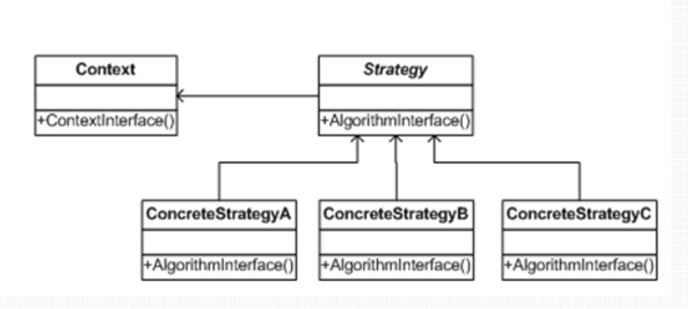
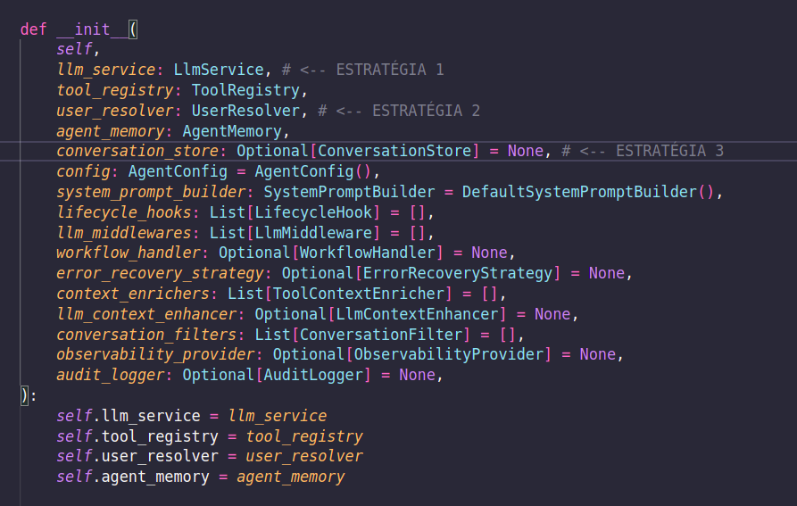

# Evidências - padrões de projeto

Este documento apresenta *provas concretas, com trechos de código e explicações claras, demonstrando que as classes UserResolver, ConversationStore e LlmService são utilizadas pelo Agent como **estratégias, caracterizando o **Padrão Strategy*.

> O objeto "cliente" (neste caso, o Agent) *não sabe* como a estratégia funciona — ele só a usa por meio de uma interface.

## padrão de projeto Strategy 

O padrão Strategy define uma família de algoritmos(estratégias), encapsula cada uma delas e as torna intercambiáveis sem alterar o código do cliente.

Objetivo: Criar uma Strategy para cada variante e fazer com que o método delegue o algoritmo para uma instância de Strategy, ou seja, parametrizar os algoritmos usados e tornar uma classe "aberta" a novos algoritmos.

---

# Como o projeto Vanna utiliza o padrão strategy

## Classe UserResolver:

python
class UserResolver(ABC):
    @abstractmethod
    async def resolve_user(self, request_context: RequestContext) -> User:
        pass

 Interface clara: define "como resolver o usuário", mas não implementa nada.

## Classe ConversationStore

python
class ConversationStore(ABC):
    @abstractmethod
    async def create_conversation(...):
        pass

Interface clara: define "como armazenar conversas", mas quem implementa decide onde e como.

O padrão implementado é o que o Strategy exige:

* Uma família de comportamentos
* Cada comportamento é definido por uma interface
* A implementação é decidida depois

---

#  3. A classe Agent depende das interfaces, não das implementações

 A classe Agent não cria estratégias. Elea recebe estratégias prontas, exatamente como o Strategy define.
 A figura abaixo representa o trecho do construtor da classe, evidenciando que recebe tais estrategias e delega a responsabilidades pra tais classes abstratas.

---